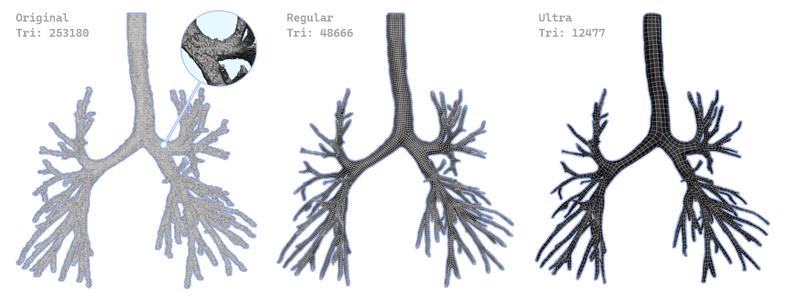

# 自动化3D模型重拓扑守护进程



## 项目简介
本项目是一个自动化的3D模型重拓扑守护进程，支持批量处理、中文文件名、xremesh自适应网格数量、全流程自动清理和详细日志。适用于医学、工业等大批量3D模型自动重拓扑场景。

## 主要特性
- **全自动批量处理**：监控输入目录，自动解压、格式转换、Remesh、再转换、打包输出。
- **中文文件名支持**：全流程支持中文OBJ/FBX/MTL文件名，自动ASCII映射与还原。
- **xremesh参数自适应**：TargetQuadCount自动读取FBX三角面数，自适应Remesh参数全自动写入。
- **可配置**：所有路径、可执行文件、数据库等均可在`config.yaml`中配置。
- **任务安全**：断电/异常恢复安全，任务失败自动清理临时目录。
- **详细日志**：所有处理流程和异常均有详细日志，便于追踪和维护。

## 目录结构
```
.
├── main.py                # 主循环，任务调度
├── pipeline.py            # 任务处理主流程
├── remesher.py            # xremesh参数生成与调用
├── converter.py           # Blender做模型格式转换和信息读取
├── cleanup.py             # 任务清理逻辑
├── utils/
│   ├── chinese_ascii.py   # 中文与ASCII名互转
│   └── zip.py             # 解压/打包工具
├── db/
│   └── database.py        # SQLite任务数据库
├── config.yaml            # 配置文件
├── requirements.txt       # Python依赖
├── spec.md                # 技术规格文档
├── README.md              # 本说明文件
├── vendor/
│   ├── QuadRemesher1.3.0.3452/  # 自行下载放入
│   ├── blender-4.5.3-windows-x64/ # Blender 自行下载
│   └── blenderTemplate/   # 无用
└── test/                  # 测试数据与输出
```

## 安装与依赖
- Python 3.8+
- 依赖包：见`requirements.txt`
- 需手动准备：
  - `vendor/QuadRemesher1.3.0.3452/EngineWin/xremesh.exe`（或对应平台）
  - `vendor/blender-4.5.3-windows-x64/blender.exe`（或对应平台）
- 数据库和工作目录会自动创建，无需手动干预。

## 使用方法
1. 配置`config.yaml`，填写输入、输出、工作目录、可执行文件路径等。
2. 下载 [vendor.zip](https://pan.baidu.com/s/1RuzcdCjs6UoGFLoHj6lR_A?pwd=wi3b)，并解压到 vendor 目录，里面包含了 blender 和 xremesh 的可执行文件。解压后应该有以下目录：
  ```
  vendor/
  ├── QuadRemesher1.3.0.3452/
  | ├── ...
  | └── EngineWin/
  |   ├── ...
  |   └──xremesh.exe
  └── blender-4.5.3-windows-x64/
    ├── ...
    └── blender.exe

  ```

3. 安装依赖，启动主程序：
   ```bash
   pip install -r requirements.txt
   python main.py
   ```
4. 将待处理的zip包放入`test/in_zips/`（或配置的input_dir）。
5. 程序会自动处理，结果zip包输出到`test/out_zips/`（或配置的output_dir）。
6. 处理过程和异常会记录在`daemon.log`。work_dir目录下会自动创建临时目录，处理完成后会自动清理，里面可以查看blender 的log。